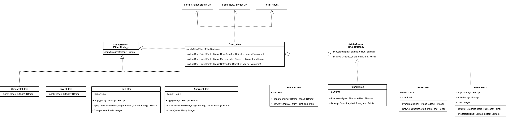

# 🖌️ ImageEditor_StrategyPattern

Lightweight image editor demonstrating the **Strategy design pattern** for brushes and filters.  
Лёгкий фоторедактор, демонстрирующий применение паттерна **«Стратегия»** для кистей и фильтров.

---

## 📌 About / О проекте

🎓 Developed for an Object-Oriented Analysis and Design (OOAD) course.  
💡 Features pluggable brush and filter strategies.  
📦 Modular, extendable, multilingual (EN / RU).

🎓 Разработано в рамках курса по ООАП.  
💡 Реализованы взаимозаменяемые стратегии кистей и фильтров.  
📦 Модульная, расширяемая и многоязычная архитектура.

---

## 🔧 Features / Возможности

- 🖌️ Multiple brush types (simple, blur, eraser)  
  Несколько типов кистей (обычная, размытая, ластик)

- 🎨 Basic filters (grayscale, invert, blur)  
  Базовые фильтры (Ч/Б, инверсия, размытие)

- ↩️ Undo support  
  Поддержка отмены последнего действия

- 🌐 Multilingual interface (EN / RU)  
  Многоязычный интерфейс (русский / английский)

- 🧠 Strategy-based architecture  
  Архитектура на основе паттерна «Стратегия»

---

## 📁 Structure / Структура

- `IBrushStrategy` / `IFilterStrategy` — interfaces for brushes & filters  
  Интерфейсы стратегий кистей и фильтров

- `MainForm.cs` — UI + logic for switching strategies  
  UI и логика выбора стратегий

- `Forms/` — settings, canvas size, about, etc.  
  Доп. формы: настройки, холст, справка и др.

---

## 🖼 Screenshots / Скриншоты

  
*Рис. 1 — Паттерн «Стратегия» в архитектуре программы*

---

